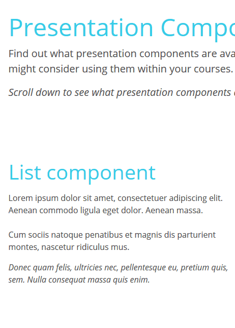

# adapt-list

**List** is a *presentation component* which displays text in a list. Text can be in an ordered, or unordered, list with or without an image.

### Attributes

[**core model attributes**](https://github.com/adaptlearning/adapt_framework/wiki/Core-model-attributes): These are inherited by every Adapt component. [Read more](https://github.com/adaptlearning/adapt_framework/wiki/Core-model-attributes).

**\_component** (string): This value must be: `text`.

**\_classes** (string): CSS class name to be applied to **List**’s containing `div`. The class must be predefined in one of the Less files. Separate multiple classes with a space. Supported classes are `"align-items-vert-center"` which aligns either the step number or image centrally, on the vertical axis, with the content.

**\_layout** (string): This defines the horizontal position of the component in the block. Acceptable values are `full`, `left` or `right`.

**\_animateList** (boolean): If set to `true`, the list of items will animate when scrolled into view. The default value is `false`.

**\_percentInviewVertical** (number): Controls what percentage of the list items height needs to be in the viewport in order for the items to animate. Default value is 70% inview from top of screen. You only need to set this property if you want to override the default value.

**\_orderedList** (boolean): If set to `true`, each item in the list will numbered. The default value is `false`.

**\_items** (string): Multiple items may be created. Each item represents one list item for this component and contains values for **title**, **body**, **\_imageSrc** and **alt**.

>**title** (string): This is the title text for the list item.

>**body** (string): This is the main body text for the list item.

>**\_imageSrc** (string):  File name (including path) of the image. Path should be relative to the *src* folder (e.g., *course/en/images/origami-menu-two.jpg*). Only supported when **\_orderedList** is set to `false`.

>**alt** (string): This text becomes the image’s `alt` attribute.

## Limitations

No known limitations.

----------------------------
**Version number:**  3.1.0  
**Framework versions:** 5+  
**Author / maintainer:** Kineo  
**Accessibility support:** WAI AA  
**RTL support:** Yes  
**Cross-platform coverage:** Chrome, Chrome for Android, Firefox (ESR + latest version), Edge, IE11, Safari 12+13 for macOS/iOS/iPadOS, Opera 
