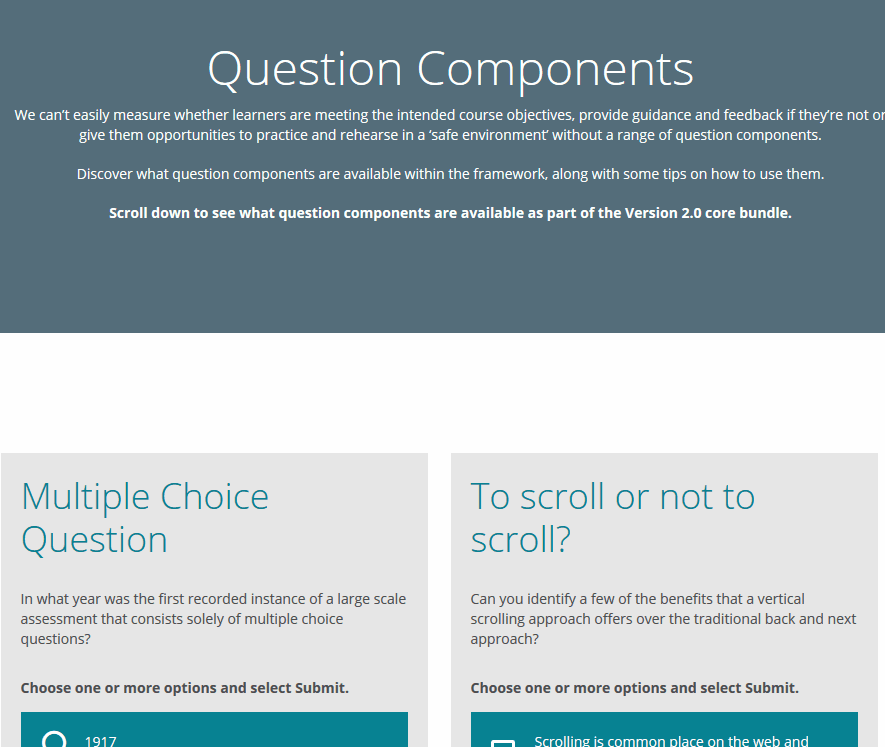

adapt-submitAll
================

An Adapt extension that allows all the questions in an article to be submitted in one go via a single submit button.

The extension will hide the 'buttons' `
` for all the questions within the article and append its own submit button after either the last block in the article or the one specified in `_insertAfterBlock`

You should ensure that all questions within the article are set to 'do not show feedback' (either by setting `_canShowFeedback` to `false` on the individual question components or - if an assessment article - by setting `_questions._canShowFeedback` to `false` in the article's `_assessment` configuration) - if you don't, all the feedback will be shown at once which is unlikely to be desirable...

Also note that because the standard button group for each question gets hidden, the user will have no way of accessing the 'correct answer' functionality.
